# DAA Assignment 2 - Data Structures

## 1. Introduction

This project implements three data structures from scratch:
DynamicArray, MyLinkedList, and MinHeap.

The structures store primitive int values. DynamicArray and MinHeap use int arrays.
The project also includes JUnit tests, operation counters, benchmarks, CSV results,
and plots.

## 2. Complexity Analysis
### DynamicArray

| Operation | Best | Average | Worst | Auxiliary Space | Explanation |
|---|---|---|---|---|---|
| add(x) | Θ(1) | Θ(1) amortized | Θ(n) | Θ(n) during resize | Usually adds at the end, but resizing copies all elements. |
| add(index, x) | Θ(1) | Θ(n) | Θ(n) | Θ(n) during resize | Elements after the index may need to be shifted. |
| remove(index) | Θ(1) | Θ(n) | Θ(n) | Θ(1) | Elements after the removed value are shifted left. |
| get(index) | Θ(1) | Θ(1) | Θ(1) | Θ(1) | Array provides direct access by index. |
| contains(x) | Θ(1) | Θ(n) | Θ(n) | Θ(1) | Search checks elements from the beginning. |

### MyLinkedList

| Operation | Best | Average | Worst | Auxiliary Space | Explanation |
|---|---|---|---|---|---|
| add(x) | Θ(1) | Θ(1) | Θ(1) | Θ(1) | A tail reference allows direct insertion at the end. |
| add(index, x) | Θ(1) | Θ(n) | Θ(n) | Θ(1) | The list may need to move through nodes to reach the index. |
| remove(index) | Θ(1) | Θ(n) | Θ(n) | Θ(1) | Removing the head is constant time, but other positions require traversal. |
| get(index) | Θ(1) | Θ(n) | Θ(n) | Θ(1) | Nodes are visited one by one until the requested index. |
| contains(x) | Θ(1) | Θ(n) | Θ(n) | Θ(1) | The value may be found immediately or after checking the whole list. |

### MinHeap

| Operation | Best | Average | Worst | Auxiliary Space | Explanation |
|---|---|---|---|---|---|
| insert(x) | Θ(1) | Θ(log n) | Θ(n) | Θ(n) during resize | Bubble-up is normally logarithmic, but resizing can copy the array. |
| peekMin() | Θ(1) | Θ(1) | Θ(1) | Θ(1) | The minimum value is stored at the root. |
| extractMin() | Θ(1) | Θ(log n) | Θ(log n) | Θ(1) | The last value is moved to the root and may bubble down. |

## 3. Loop Invariant Proofs

### 3.1 DynamicArray contains(x)
The contains(x) method checks the array from the beginning to the end.

**Invariant:**  
Before each iteration, all elements before index i have already been checked
and none of them is equal to x.

**Initialization:**  
At the beginning, i = 0. There are no elements before index 0, so the invariant
is true.

**Maintenance:**  
During each iteration, the element at index i is compared with x.
If it is equal to x, the method returns true.
If it is not equal, i increases by one. Therefore, all elements before the new
index i have been checked and are not equal to x.

**Termination:**  
The loop stops when x is found or when i becomes equal to size.

**Conclusion:**  
If x is found, the method correctly returns true. If the loop reaches the end,
all elements were checked and none was equal to x, so the method correctly
returns false.

### 3.2 MinHeap bubbleDown()
The bubbleDown() method restores the MinHeap property after extractMin().

**Invariant:**  
Before each iteration, the heap property is correct everywhere except possibly
at the current index. The current element may be larger than one of its children.

**Initialization:**  
After extractMin(), the last element is moved to the root. The left and right
subtrees are still valid MinHeaps, but the new root may violate the heap property.
Therefore, the invariant is true at the beginning.

**Maintenance:**  
The method compares the current element with its left and right children.
It finds the smallest value. If one of the children is smaller, the current
element is swapped with the smallest child. After the swap, the heap property
is restored at the old position. The only possible violation moves to the new
current position, so the invariant remains true.

**Termination:**  
The loop stops when the current element is not larger than either child,
or when it has no children.

**Conclusion:**  
When the loop finishes, there is no possible violation at the current position.
Therefore, the MinHeap property is restored and every parent is less than or
equal to its children.

## 4. Benchmark Results
The benchmark was executed for n = 100, 1,000, 10,000, and 100,000.
The same random data was generated using Random(42).
Each measured case was executed five times after a warm-up run, and the median
execution time was saved.

### W1 - Random Access

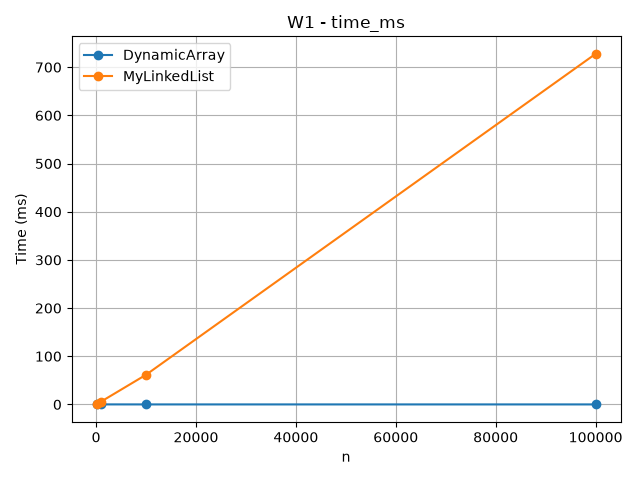

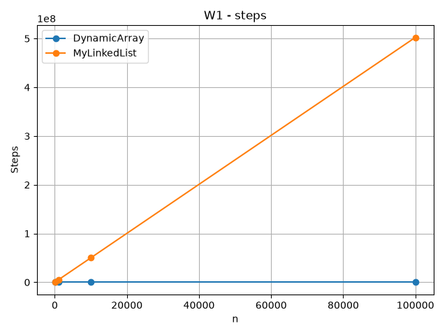

DynamicArray has constant-time random access because it directly accesses an
array index. MyLinkedList must move through nodes to reach an index, so the
number of steps increases significantly when n becomes larger.

### W2 - Search

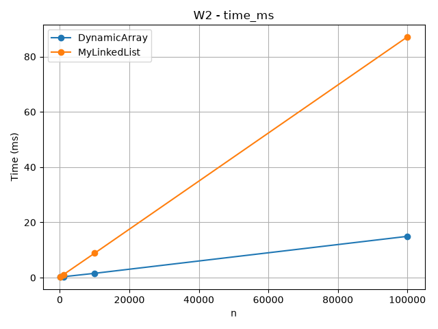

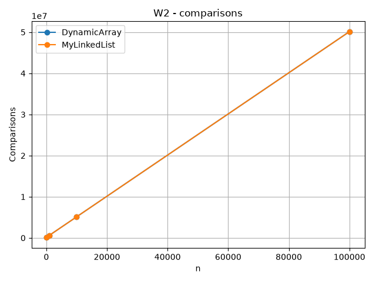

Both structures use linear search for contains(x). Their asymptotic complexity
is similar, but DynamicArray can be faster in practice because its values are
stored next to each other in memory.

### W3 - Insert and Remove at Head

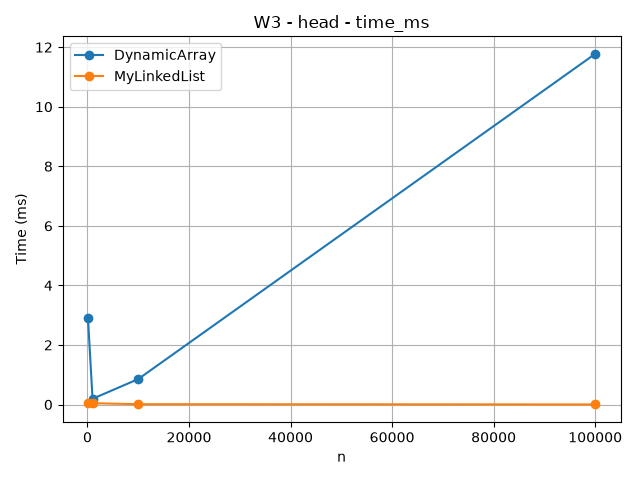

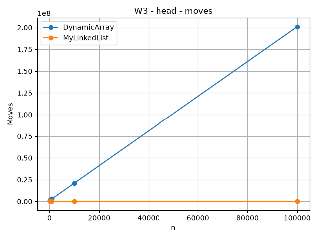

MyLinkedList performs head insertion and removal efficiently because it only
changes links. DynamicArray must shift many elements when an element is inserted
or removed at the beginning.

### W3 - Insert and Remove at Middle

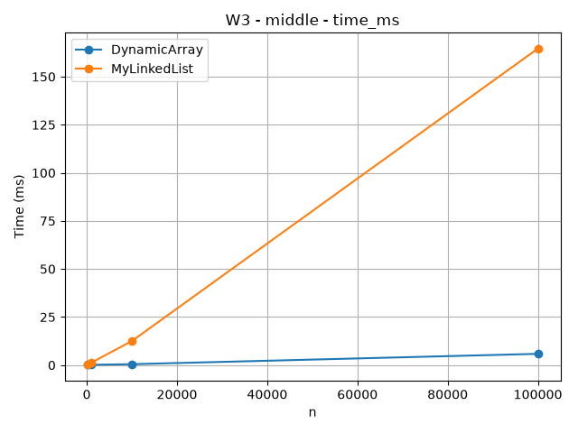

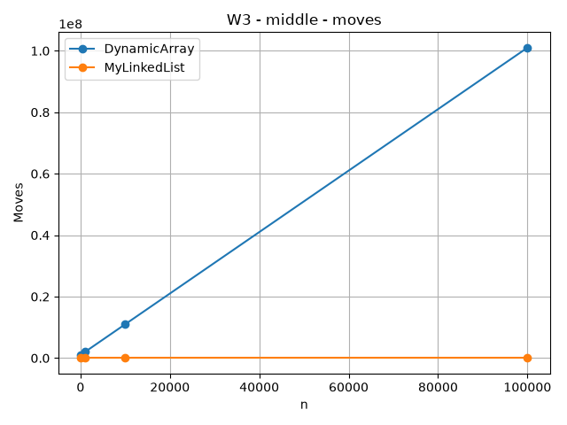

DynamicArray shifts elements during middle insertion and removal.
MyLinkedList does not shift stored values, but it must traverse nodes to reach
the middle position.

### W4 - Priority Processing

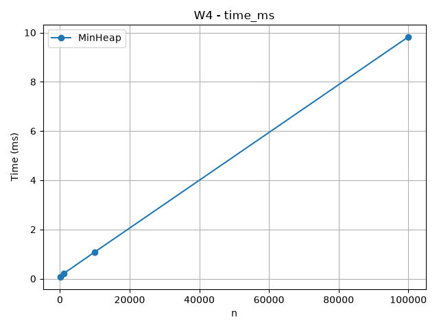

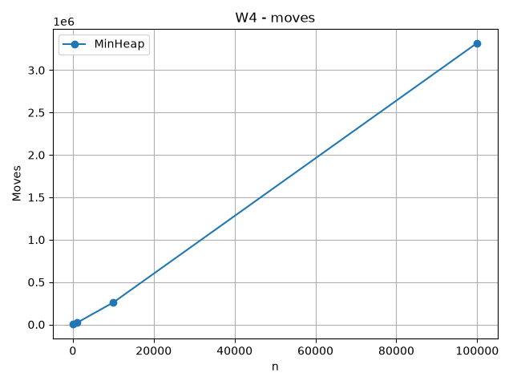

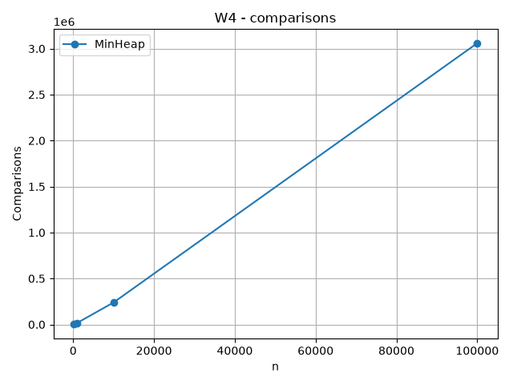

MinHeap keeps the minimum element at the root. Insert uses bubble-up and
extractMin uses bubble-down. The benchmark also checks that extracted values
are in non-decreasing order.

## 5. Discussion
DynamicArray and MyLinkedList have different performance because they store
data differently. DynamicArray stores int values next to each other in memory.
This gives good spatial locality because the CPU can load several nearby values
into a cache line. For this reason, DynamicArray is usually faster for get()
and sequential operations.

MyLinkedList stores values inside separate Node objects. These nodes may be
located in different places in memory. To reach another node, the program must
follow the next reference, which is called pointer chasing. This can cause more
cache misses and make the linked list slower even when two operations have
similar Big-O complexity. Node objects also require additional memory for
references and object headers, and many objects can create more work for the
garbage collector.

However, MyLinkedList is useful for insertion and removal at the head because
it only needs to update links and does not shift all elements. DynamicArray is
better when fast random access is important. MinHeap is better when the program
repeatedly needs the smallest element because peekMin() is constant time and
insert/extract operations are efficient. Therefore, the best data structure
depends on the workload and not only on asymptotic complexity.

## 6. Conclusion
This assignment compared DynamicArray, MyLinkedList, and MinHeap using both
theoretical analysis and practical benchmarks. The results show that the best
data structure depends on the type of operation.

DynamicArray provides fast random access and good cache locality, while
MyLinkedList is efficient for insertion and removal at the head. MinHeap is
useful for priority processing because it keeps the minimum element at the root.

The experiment also showed that Big-O complexity is not the only factor that
affects real performance. Memory layout, cache locality, pointer chasing, and
the number of physical operations can also change execution time.